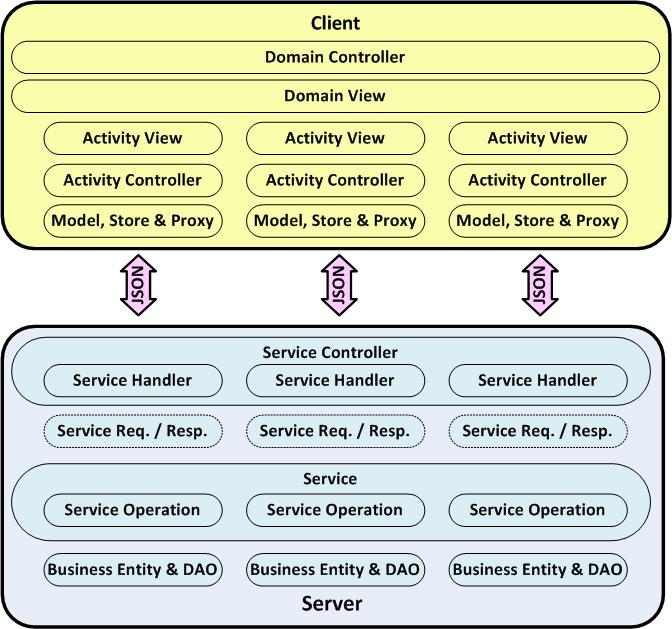

# Application Architecture

Baff provides a unified application architecture across client and server processing tiers based on
the frameworks provided by Sencha, Spring and JEE, which support commonly adopted application
design patterns such as model-view-controller (MVC) and those associated with domain driven design.

## Application Components

Baff application design is primarily orientated around the business activities that manage the state 
of business entities.  The primary functional design pattern supported by the framework supports view
and update of individual business entities.  However, the framework also supports representation and
management of the relationships between entities as well as automation of business processes
involving multiple activities.

+   **Domain Controller**: Controls a set of related activities, typically related to maintaining a master 
business entity and associated child entities.
+   **Domain View**: Tabulates a set of views associated with activities.
+   **Activity Controller**: Controls a discrete activity, where an activity represents a logical unit of 
work involving CRUD operations upon upon a particular business entity.
+   **Activity View**: Provides the user interfaces for an activity, including forms, lists, buttons, search
panels and any other widgets.
+   **Model**: Represents a business entity on the client, implementing entity specific validation.  Has 
an associated **Store** and **Proxy** for communication with the server via JSON.
+   **Service Controller**: Manages service request and responses, which are transmitted to/from the
service via JSON based data transfer objects (DTOs).  Implements cross-entity, operation specific 
validation.
+   **Service**: Performs service operations for activities, where typically there is an operation to
support read, save (create or update) and remove actions on an activity.
+   **Business Entity**: Represents a business entity on the server, implementing entity specific
validation and supporting serialization to/from DTOs.  Has an associated data access object (DAO).

## Inversion of Control

Building an application involves extending from these foundation classes to define the
required information structures and business functionality.  The Baff framework adopts an inversion of
control design (IoC) to take care of much of the work involved in orchestrating these classes and 
performing generic tasks with the developer only requiring to complete application specific methods,
in particular:

+   **User Interface**: Define the list and form layout, prepare the form for displaying a record, 
manage form state due to changes to widgets and related values.
+   **Validation**: Specify entity (field and cross field) validation and more general (operation and 
cross entity) feasibility validation.  The framework provides a consistent way to implement this as well
as handle validation errors at runtime irrespective of where they are determined.
+   **Service Operations**: Define service operations and processing, including any custom
persistence routines required to support this.
+   **Entity Definition**: Specify business entity attributes and serialization.  Typically client models 
map directly to server entities.

{@img ioc.jpg Inversion of Control}

## Activity Design Patterns

To realise the benefits of the Baff, the application design must be based on the activity design 
patterns supported by the framework as illustrated below.

{@img activities.jpg Activity Patterns}

+   **Selector Activity**: An activity to view a list of business entities of the same type, e.g.
customers.  Variants of this pattern include filtering on specific entity properties, e.g. name or type,
the ability to select an entity in the list as input to another activity, and the ability to delete an entity
in the list.
+   ** Form Activity**: An activity to view and maintain a single business entity, supporting create, 
update and delete operations on the entity.  Variants of this pattern can limit the operations able to 
be performed and whether the underlying data is a single record or multiple records.
+   **List Form Activity**: An activity that combines the above patterns in order to manage a list
of related entities, e.g. addresses for a customer.

These adopt the following high level state model.

{@img states.jpg State Model}

The behaviour of these activities is highly configurable to allow them to be tailored for specific needs
and the Form Activity in particular can adopt differnt configuraitons to support the following sub patterns:

+   Maintain a single entity record in a 1-1 relationship with a master, e.g. customer details.
+   Create an entity record in a M-1 relationship with a master, e.g. submit a customer order.
+   Create and view (and optionally update) newly created entity record in a M-1 relationship with a master,
but never display previously created entities.
+   Maintain and replace the "first" entity record in a M-1 relationship with a master, e.g. manage current
address.

Refer to the user interface guide for more details of how these patterns are presented to the end user, 
including dashboard support.  