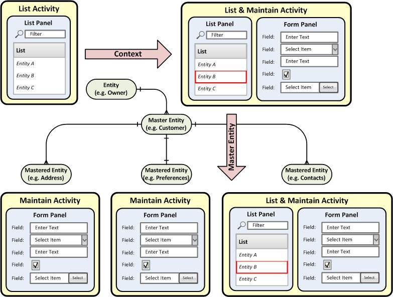
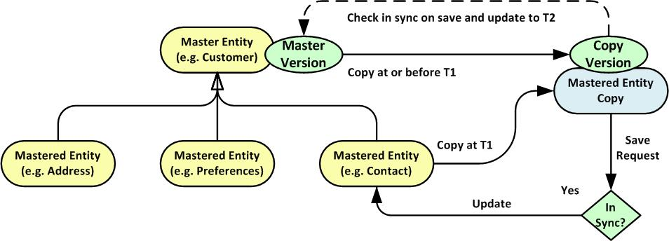

# Entities & Activities

## Domain Model

A master entity is the primary entity within a domain where related entities may be considered
extensions of the master.  Baff supports an application design that is orientated around such a 
domain model, as illustrated by the reference Evaluator application. 

   
+  There is a scorecard entity that masters criteria and options
+  The activity that maintains the scorecard entity provides the master context to the activities that
maintain the mastered criteria and option entities
+  One to one relationships with the master are typically handled by a Maintain Activity, whilst many to
one relationships are handled by a List & Maintain Activity. 
+  There is an evaluation group entity that masters evaluators and owns scorecards
+  A scorecard is owned (but not masterered) by an evaluation group; the evaluation group is passed as
context to the scorecard activity

Refer to the user interface guide that for more details of how this is presented to the end user.  

## Version Control

One of the key features of Baff is the support for master entity level version control.  The purpose of 
this is to ensure the integrity of the data when more than one user attempts to update it at the same 
time.  It also ensures the integrity of data visible on the client by ensuring that any changes made are 
based on the correct view of all related data whilst optimising the performance benefits of client side 
caching and version management.

Baff also adopts an optimistic locking strategy such that the validity of data is only checked when it is
requested to be updated, rather than locking it when it is initially retrieved.  This is independent of
whether master entity level version control is applied.

## Data Integrity

As well as applying version control Baff also checks for the presence of a valid master for any mastered
entities, as well as supporting customisation to include appropriate data integrity checks; the framework
automatically handles these, although the default behaviour can also be overridden.  

## Version Control Configuration

### Full: Both Client and Server Version Control
This provides the most effective approach but is technically not the most efficient.

1.  Client stores master entity before any mastered entity is loaded
2.  Server sets mastered entity version from master on load
3.  Client checks versions on view to see if master entity is still up to date (optional)
4.  Client sets mastered entity version from stored master
5.  Server retrieves master and checks version against updated entity version and currency

**Important Note:** If using Object Relational Mapping to such that a mastered entity field references the master
entity, e.g. reflecting a foreign key, and this field is accessed then this will load the master in any case, so may
as well adopt this approach.  The ORM approach also allows the master entity field to mapped via multiple relationships 
such that only the foreign key for the immediate parent needs to be specified on the database, e.g.
ChildMasteredEntity -> ParentMasteredEntity -> MasterEntity.

**Client Settings** 

    useVersionManager = true
    checkVersionOnView = true (optional)
    setVersionFromMaster = true

**Server Settings**

    versionControl = true
    currencyControl = true
    setMasterOnLoad = true

### Client Managed: Client manages mastered entity versions.
This is more efficient than A since it avoids having to obtain the master version on entity load.  However the client
cannot pro-actively check for the master being up to date based on the latest data loaded.

1.  Client stores master entity before any mastered entity is loaded
2.  Server does not set mastered entity version from master on load
3.  Client does not check version on view to see if master entity is still up to date
4.  Client sets mastered entity version from stored master
5.  Server retrieves master and checks version against updated entity version and currency

**Note:** Assuming not using ORM to define the master entity id field (otherwise may as well use Full VC approach)
in most cases the mastered entity will therefore require a FK field that maps directly to the master entity in order
to support retrieval filtering; this requires a master FK field on the database.  And an ORM mapping must be still
specified in order to support retrieval of the master for update processing.

**Client Settings** 

    useVersionManager = true
    checkVersionOnView = false // not possible to set to true
    setVersionFromMaster = true

**Server Settings**

    versionControl = true
    currencyControl = true
    setMasterOnLoad = false

### Server Managed: Server manages mastered entity versions
This avoids client-side processing, but is not as efficient nor as effective as a result; whilst it maintains data
integrity it cannot ensure consistency of information presented on the client

1.  Client does not store master entity before any mastered entity is loaded
2.  Server sets mastered entity version from master on load
3.  Client does not check version on view to see if master entity is still up to date
4.  Client does not set mastered entity version from stored master
5.  Server retrieves master and checks version against updated entity version and currency

**Client Settings**
 
    useVersionManager = true
    checkVersionOnView = false
    setVersionFromMaster = false

**Server Settings**

    versionControl = true
    currencyControl = true
    setMasterOnLoad = true

### Currency Control: Server manages mastered entity versions based on currency
This avoids client side processing and is efficient as it avoids having to obtain the version from the master when 
the entity is loaded, however whilst it maintains data integrity it cannot ensure consistency of information presented 
on the client.  There is also a very small risk that the master could be updated in between the time the entity
is retrieved and when the currency is set, although this should be microseconds.

1.  Client does not store master entity before any mastered entity is loaded
2.  Server sets mastered entity currency based on time at load
3.  Client does not check version on view to see if master entity is still up to date
4.  Client does not set mastered entity version from stored master
5.  Server retrieves master and checks version against updated entity currency

**Client Settings**
 
    useVersionManager = true
    checkVersionOnView = false
    setVersionFromMaster = false

**Server Settings**

    versionControl = false
    currencyControl = true
    setMasterOnLoad = false
